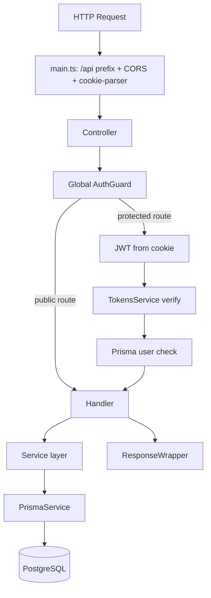

# Архітектура бекенду (`src/`)

## 1) Загальна модель

Поточний бекенд побудований на **NestJS** з **модульною (feature-based) архітектурою**:

- кожна бізнес-область — окремий модуль (`auth`, `user`),
- інфраструктурні речі винесені в окремі модулі (`database`, `shared`),
- глобальні кросс-секційні механізми (валідація, guard) підключені в `AppModule`.

Основна точка входу:

- `src/main.ts` — bootstrap, global prefix `/api`, CORS, cookies.
- `src/app.module.ts` — композиція модулів + глобальні провайдери.

## 2) Поточна структура `src/`

```text
src/
├── main.ts
├── app.module.ts
├── database/
│   ├── database.module.ts
│   └── prisma.service.ts
├── shared/
│   ├── decorators/
│   ├── guards/
│   ├── response/
│   ├── services/
│   ├── templates/
│   └── shared.module.ts
├── auth/
│   ├── controllers/
│   ├── dto/
│   ├── services/
│   └── auth.module.ts
└── user/
    ├── controllers/
    ├── dto/
    ├── services/
    └── user.module.ts
```

## 3) Модулі та відповідальність

### `AppModule`

Файл: `src/app.module.ts`

Відповідає за:

- імпорт усіх модулів (`DatabaseModule`, `SharedModule`, `AuthModule`, `UserModule`),
- глобальну конфігурацію (`ConfigModule.forRoot({ isGlobal: true })`),
- глобальний `ZodValidationPipe` через `APP_PIPE`,
- глобальний `AuthGuard` через `APP_GUARD`,
- throttling (`ThrottlerModule`).

### `DatabaseModule`

Файли: `src/database/database.module.ts`, `src/database/prisma.service.ts`

Відповідає за:

- єдину точку доступу до Prisma (`PrismaService`),
- підключення до БД при ініціалізації модуля.

### `SharedModule`

Файл: `src/shared/shared.module.ts`

Відповідає за спільні технічні сервіси:

- `TokensService` (JWT),
- `CookieService`,
- `EmailService`,
- `HashService`.

Також в `shared/` є:

- декоратори (`@Public`, `@User`, `@Roles`),
- guard (`AuthGuard`),
- універсальна обгортка відповіді (`ResponseWrapper`),
- email templates.

### `AuthModule`

Файли: `src/auth/*`

Відповідає за повний auth lifecycle:

- реєстрація,
- логін/логаут,
- refresh токенів,
- верифікація email,
- forgot/reset password.

### `UserModule`

Файли: `src/user/*`

Відповідає за user profile-level операції:

- отримання поточного користувача,
- оновлення профілю.

## 4) Потік HTTP-запиту



## 5) Конвенції, які вже використовуються

1. **Feature-модулі** (`auth`, `user`) мають папки: `controllers`, `services`, `dto`.
2. **DTO + Zod**:
   - DTO створюються через `createZodDto`,
   - валідація відбувається через `ZodValidationPipe`.
3. **Alias imports** з `tsconfig.json`:
   - `@database/*`, `@shared/*` (використовуються активно).
4. **Auth в cookie**:
   - `accessToken`/`refreshToken` зберігаються в httpOnly cookies.
5. **Response contract**:
   - часто використовується `new ResponseWrapper(data)`.

## 6) Практичні архітектурні принципи для цього репозиторію

- Тримати бізнес-логіку в `services`, не в контролерах.
- Контролер = транспортний шар (валідація input, читання cookies/headers, виклик сервісу, формування response).
- Доступ до БД — через `PrismaService`, не напряму в контролері.
- Все, що повторюється між фічами й не містить доменної специфіки, розглядати як кандидат у `shared`.

## 7) Поточне обмеження (важливо)

У `prisma/schema.prisma` уже описано багато доменів (organization, task, chat, review тощо), але в `src/` наразі реалізовані переважно `auth` і `user` модулі. Тобто схема БД ширша за поточний API шар — це нормально для етапу поступового розвитку.
