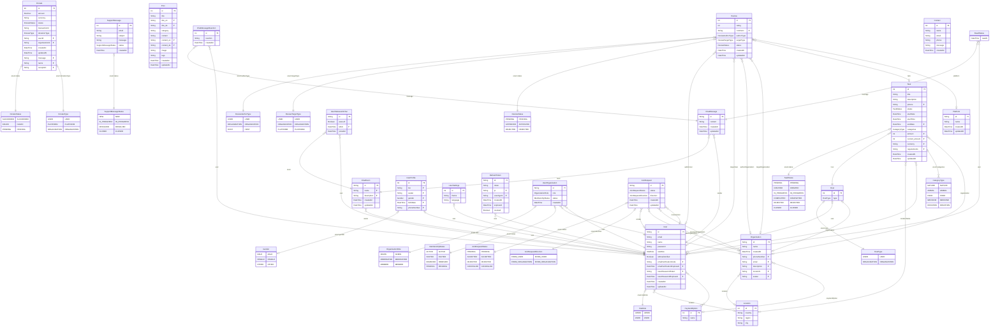

```mermaid
erDiagram

        MembershipStatus {
            ACTIVE ACTIVE
INVITED INVITED
REMOVED REMOVED
PENDING PENDING
        }
    


        SiteRole {
            ADMIN ADMIN
USER USER
        }
    


        OrganizationRole {
            ADMIN ADMIN
MODERATOR MODERATOR
MEMBER MEMBER
        }
    


        JoinRequestStatus {
            PENDING PENDING
ACCEPTED ACCEPTED
REJECTED REJECTED
CANCELLED CANCELLED
        }
    


        JoinRequestDirection {
            FROM_USER FROM_USER
FROM_ORGANIZATION FROM_ORGANIZATION
        }
    


        Gender {
            MALE MALE
FEMALE FEMALE
OTHER OTHER
        }
    


        ReviewTargetType {
            USER USER
ORGANIZATION ORGANIZATION
PLATFORM PLATFORM
        }
    


        ReviewAuthorType {
            USER USER
ORGANIZATION ORGANIZATION
HOST HOST
        }
    


        ReviewStatus {
            PENDING PENDING
APPROVED APPROVED
REJECTED REJECTED
        }
    


        DonateStatus {
            SUCCEEDED SUCCEEDED
FAILED FAILED
PENDING PENDING
        }
    


        DonateType {
            USER USER
PLATFORM PLATFORM
ORGANIZATION ORGANIZATION
        }
    


        TaskStatus {
            PENDING PENDING
CREATED CREATED
IN_PROGRESS IN_PROGRESS
COMPLETED COMPLETED
REJECTED REJECTED
CLOSED CLOSED
        }
    


        CategoryType {
            NATURE NATURE
ANIMAL ANIMAL
FOOD FOOD
MEDICINE MEDICINE
DONATION DONATION
        }
    


        HostType {
            USER USER
ORGANIZATION ORGANIZATION
        }
    


        SupportMessageStatus {
            NEW NEW
IN_PROGRESS IN_PROGRESS
RESOLVED RESOLVED
CLOSED CLOSED
        }
    
  "ChatRoom" {
    String id "🗝️"
    String name "❓"
    String description "❓"
    DateTime createdAt 
    DateTime updatedAt 
    }
  

  "UserStatusesInChat" {
    String id "🗝️"
    Boolean wasLeft 
    DateTime leftAt "❓"
    DateTime joinedAt 
    }
  

  "ChatMessage" {
    String id "🗝️"
    String content 
    DateTime createdAt 
    DateTime updatedAt 
    }
  

  "ChatMessageReaction" {
    Int id "🗝️"
    String reaction 
    DateTime createdAt 
    }
  

  "ReadStatus" {
    DateTime readAt 
    }
  

  "Platform" {
    String id "🗝️"
    String name 
    DateTime createdAt 
    DateTime updatedAt 
    }
  

  "Post" {
    Int id "🗝️"
    String title 
    String title_en "❓"
    String title_de "❓"
    String category 
    String content 
    String content_en "❓"
    String content_de "❓"
    String image 
    String tags 
    DateTime createdAt 
    DateTime updatedAt 
    }
  

  "SupportMessage" {
    Int id "🗝️"
    String email 
    String subject 
    String message 
    SupportMessageStatus status 
    DateTime createdAt 
    }
  

  "Task" {
    Int id "🗝️"
    String title 
    String description 
    String picture "❓"
    TaskStatus status 
    DateTime startDate 
    DateTime startTime 
    DateTime endDate "❓"
    CategoryType categories 
    Int amount "❓"
    Int current_amount "❓"
    String currency "❓"
    String requirements "❓"
    DateTime createdAt 
    DateTime updatedAt 
    }
  

  "User" {
    String id "🗝️"
    String email 
    String name 
    String password 
    SiteRole siteRole 
    Boolean isEmailVerified 
    String emailVerificationCode "❓"
    DateTime emailVerificationExpiresAt "❓"
    String resetPasswordToken "❓"
    DateTime resetPasswordExpiresAt "❓"
    DateTime createdAt 
    DateTime updatedAt 
    }
  

  "UserProfile" {
    Int id "🗝️"
    String bio "❓"
    String avatar "❓"
    Gender gender "❓"
    DateTime birthDate "❓"
    String phoneNumber "❓"
    }
  

  "UserSettings" {
    Int id "🗝️"
    String theme 
    String language 
    }
  

  "RefreshToken" {
    String id "🗝️"
    String token 
    String ip "❓"
    String userAgent "❓"
    DateTime createdAt 
    DateTime expiresAt 
    Boolean revoked 
    }
  

  "PaymentOption" {
    Int id "🗝️"
    String name 
    }
  

  "Location" {
    Int id "🗝️"
    String country 
    String region 
    String city 
    }
  

  "Organization" {
    String id "🗝️"
    String name 
    DateTime createdAt 
    String phoneNumber "❓"
    String email "❓"
    String description "❓"
    String moreInfo "❓"
    String avatar "❓"
    }
  

  "UserOrganization" {
    String id "🗝️"
    OrganizationRole role 
    MembershipStatus status 
    DateTime createdAt 
    }
  

  "JoinRequest" {
    String id "🗝️"
    JoinRequestStatus status 
    JoinRequestDirection direction 
    DateTime createdAt 
    DateTime updatedAt 
    }
  

  "Review" {
    Int id "🗝️"
    Int rating 
    String comment "❓"
    ReviewAuthorType authorType 
    ReviewTargetType targetType 
    ReviewStatus status 
    DateTime createdAt 
    DateTime updatedAt 
    }
  

  "Contact" {
    Int id "🗝️"
    String name 
    String email 
    String phone 
    String message 
    DateTime createdAt 
    }
  

  "Donate" {
    Int id "🗝️"
    Decimal amount 
    String currency 
    DonateStatus status 
    String transactionId 
    DonateType donationType 
    String userId "❓"
    String organizationId "❓"
    DateTime createdAt 
    DateTime updatedAt 
    String message "❓"
    String name "❓"
    String receiptUrl "❓"
    }
  

  "Host" {
    Int id "🗝️"
    HostType type 
    }
  
    "ChatRoom" }o--|| "User" : "owner"
    "UserStatusesInChat" }o--|| "ChatRoom" : "room"
    "UserStatusesInChat" }o--|| "User" : "user"
    "ChatMessage" }o--|| "ChatRoom" : "room"
    "ChatMessage" }o--|| "User" : "sender"
    "ChatMessageReaction" }o--|| "ChatMessage" : "message"
    "ChatMessageReaction" }o--|| "User" : "user"
    "ReadStatus" }o--|| "ChatMessage" : "message"
    "ReadStatus" }o--|| "User" : "user"
    "SupportMessage" |o--|| "SupportMessageStatus" : "enum:status"
    "Task" |o--|| "TaskStatus" : "enum:status"
    "Task" }o--|| "Host" : "host"
    "Task" }o--|o "Location" : "locationName"
    "Task" o{--}o "User" : ""
    "Task" |o--}o "CategoryType" : "enum:categories"
    "Task" }o--|o "Organization" : "organization"
    "User" |o--|| "SiteRole" : "enum:siteRole"
    "User" }o--|o "Location" : "location"
    "User" o{--}o "PaymentOption" : ""
    "UserProfile" |o--|o "Gender" : "enum:gender"
    "UserProfile" |o--|| "User" : "user"
    "UserSettings" |o--|| "User" : "user"
    "RefreshToken" }o--|| "User" : "user"
    "Organization" }o--|o "Location" : "location"
    "Organization" }o--|o "PaymentOption" : "paymentOption"
    "UserOrganization" |o--|| "OrganizationRole" : "enum:role"
    "UserOrganization" |o--|| "MembershipStatus" : "enum:status"
    "UserOrganization" }o--|| "Organization" : "organization"
    "UserOrganization" }o--|| "User" : "user"
    "JoinRequest" |o--|| "JoinRequestStatus" : "enum:status"
    "JoinRequest" |o--|| "JoinRequestDirection" : "enum:direction"
    "JoinRequest" }o--|o "User" : "sender"
    "JoinRequest" }o--|o "Organization" : "senderOrganization"
    "JoinRequest" }o--|o "Organization" : "receiverOrganization"
    "JoinRequest" }o--|o "User" : "receiverUser"
    "Review" |o--|| "ReviewAuthorType" : "enum:authorType"
    "Review" |o--|| "ReviewTargetType" : "enum:targetType"
    "Review" |o--|| "ReviewStatus" : "enum:status"
    "Review" }o--|o "User" : "authorUser"
    "Review" }o--|o "User" : "targetUser"
    "Review" }o--|o "Organization" : "authorOrganization"
    "Review" }o--|o "Organization" : "targetOrganization"
    "Review" }o--|o "Task" : "task"
    "Review" }o--|o "Platform" : "platform"
    "Donate" |o--|| "DonateStatus" : "enum:status"
    "Donate" |o--|| "DonateType" : "enum:donationType"
    "Host" |o--|| "HostType" : "enum:type"
    "Host" |o--|o "User" : "user"
    "Host" |o--|o "Organization" : "organization"
```